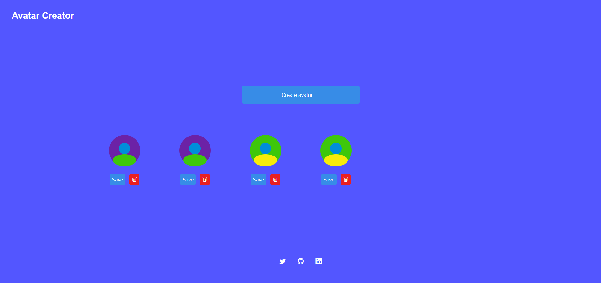
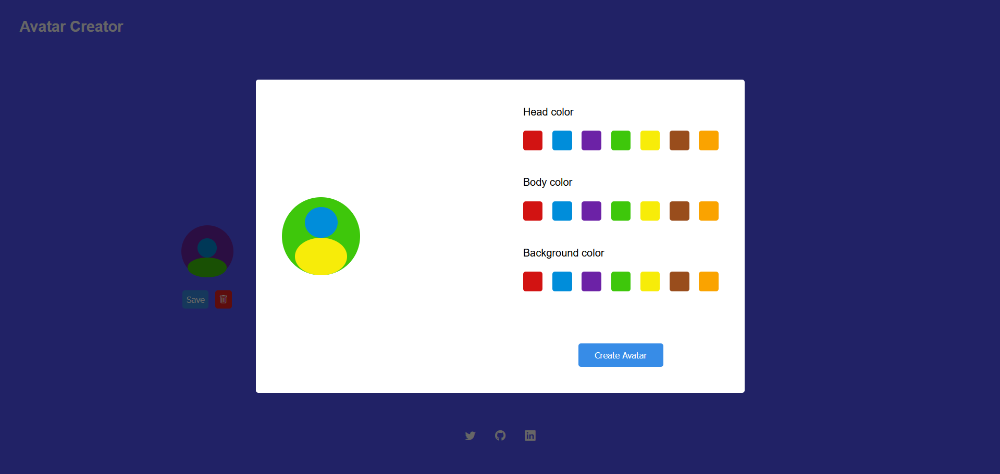

# Create Avatar

## Sobre
É um criador de avatar e que permite o usuário salvar o avatar que foi criado no computador.

## Funcionalidades

- Criar o avatar
- Listar os avateres.
- Deletar o avatar
- Salvar o avatar no computador em uma imagem.

## Tecnologias

- HTML
- CSS
- Typescript
- Vite

## Serviços
- Vercel

## Imagens

## Como acessar?

Para acessar o site é preciso apenas que você acesse o seguinte link abaixo: 
Link: https://fernandobarrosd-create-avatar.vercel.app